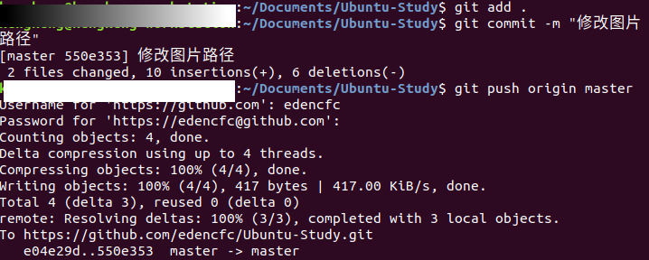

# Git的提交步骤

## 从Gtihub或Gitee中下载项目

```bash
git clone https://github.com/edencfc/Ubuntu-Study.git
```

## 配置全局用户名

```bash
git config --global user.email "your@email.com"
git config --global user.name "yourname"
```

## 查看分支

```bash
git branch
```

## 修改并提交项目

```bash
# 查看当前状态
git status
# 提交修改内容
git add .
git commit -m "填写修改内容注释"
git push origin master
```

