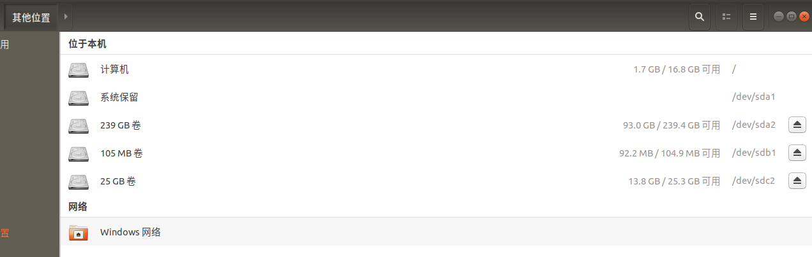
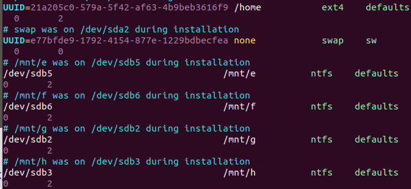




> Written with [StackEdit](https://stackedit.io/).

# 无线网卡无法识别

使用FAST FW150UM和TPLINK无线网卡在Ubuntu 18.04都出现过无法识别的情况，并且不仅仅是在新装系统时，有时无线网卡拔插后也会无法识别，而二者的解决方式却一样。

首先是查看自己无线网卡的型号与要手动安装的驱动是否一致，确认RTL8188EU驱动可用。

```bash
# github上的原始仓库
git clone https://github.com/edencfc/rtl8188eu
# 已经将该镜像同步到gitee
git clone https://gitee.com/edencfc/rtl8188eu.git
```

## 安装驱动

直接参考RTL8188EU的文档

```bash
# 进入RTL8188EU文件目录
cd rtl8188eu
make all
sudo make install
```

**重启Ubuntu操作系统后无线网卡可以识别**

*注意：RTL8188EU文件目录安装后最好不要删除，正如上文所述，无线网卡拔插后可能会无法识别，这时候需要重装驱动。*

# 开启IPV6

```bash
sudo apt-get install miredo
sudo apt install net-tools
sudo service miredo restart
ifconfig
```
Ping出的结果中如果可以看到teredo就代表开启成功

# 安装Node.js

```bash
sudo apt-get install nodejs
sudo apt-get install npm
```
启用时发现npm版本太低，不能启动项目，对npm进行更新
```bash
npm install -g npm
```
启用淘宝NPM镜像

```bash
npm install -g cnpm --registry=https://registry.npm.taobao.org
```
# 开机自动加载NTFS硬盘

## 新建目录
准备挂载的是双系统中的E、F、G、H、I盘，首先要创建用于挂载硬盘的目录
```bash
sudo mkdir /mnt/e
sudo mkdir /mnt/f
sudo mkdir /mnt/g
sudo mkdir /mnt/h
sudo mkdir /mnt/i
```
## 识别盘符
找到Ubuntu中文件盘名称和Windows盘符的对应，记录下来



## /etc/fstab修改
首先是获得读写权限
```bash
su root
```
`vim fstab`打开文件，参考已有的盘符将需要挂载的硬盘信息添加进去

如果出现`Metadata kept in Windows cache, refused to mount.`的报错，是因为双系统中Windows的硬盘并未彻底关闭，原因在Windows的快速启动功能，一种办法是关闭系统重启，进入Windows登录界面（不要登录）直接重启，再F12进入Ubuntu，重新修改fstab文件。

## 挂载硬盘
```bash
sudo mount -a
```
这样重启后E-I的NTFS分区都会自动加载了，确认以下：
```bash
cd ../../mnt
ls
```
看到e～i的目录直接进入，就能看到分区文件了

# 查看端口占用情况

```bash
# 查看所有端口占用
netstat -a
# 查看指定端口占用
lsof -i:PORT
# 结束进程
kill -9 PID
```


