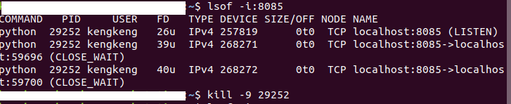

> Written with [StackEdit](https://stackedit.io/).

# 无线网卡无法识别

使用FAST FW150UM和TPLINK无线网卡在Ubuntu 18.04都出现过无法识别的情况，并且不仅仅是在新装系统时，有时无线网卡拔插后也会无法识别，而二者的解决方式却一样。

首先是查看自己无线网卡的型号与要手动安装的驱动是否一致，确认RTL8188EU驱动可用。

```bash
# github上的原始仓库
git clone https://github.com/edencfc/rtl8188eu
# 已经将该镜像同步到gitee
git clone https://gitee.com/edencfc/rtl8188eu.git
```

## 安装驱动

直接参考RTL8188EU的文档

```bash
# 进入RTL8188EU文件目录
cd rtl8188eu
make all
sudo make install
sudo depmod -a
sudo modprobe 8188eu
```

**重启Ubuntu操作系统后无线网卡可以识别**

*注意：RTL8188EU文件目录安装后最好不要删除，正如上文所述，无线网卡拔插后可能会无法识别，这时候需要重装驱动。*

## 可能出现的报错

```verilog
modporbe:ERROR could not insert '8188eu':Exec format error
```

解决办法

```bash
make clean
make all
sudo make install
sudo depmod -a
sudo modprobe 8188eu
```


# 开启IPV6

```bash
sudo apt-get install miredo
sudo apt install net-tools
sudo service miredo restart
ifconfig
```
Ping出的结果中如果可以看到teredo就代表开启成功

## 可能出现的报错

```bash
@-workstation:~$ sudo service miredo restart
[sudo] password for kengkeng: 
Job for miredo.service failed because the control process exited with error code.
See "systemctl status miredo.service" and "journalctl -xe" for details.
@-workstation:~$ systemctl status miredo.service
● miredo.service - Teredo IPv6 tunneling
   Loaded: loaded (/lib/systemd/system/miredo.service; enabled; vendor preset: e
   Active: failed (Result: exit-code) since Thu 2020-02-06 09:47:14 CST; 1min 23
  Process: 3273 ExecStartPre=/usr/sbin/miredo-checkconf -f /etc/miredo/miredo.co

2月 06 09:47:04 -workstation systemd[1]: Starting Teredo IPv6 tunneling.
2月 06 09:47:14 -workstation miredo-checkconf[3273]: Invalid host name “
2月 06 09:47:14 -workstation miredo-checkconf[3273]: Server address not 
2月 06 09:47:14 -workstation miredo-checkconf[3273]: Fatal configuration
2月 06 09:47:14 -workstation systemd[1]: miredo.service: Control process
2月 06 09:47:14 -workstation systemd[1]: miredo.service: Failed with res
2月 06 09:47:14 -workstation systemd[1]: Failed to start Teredo IPv6 tun
lines 1-12/12 (END)...skipping...
● miredo.service - Teredo IPv6 tunneling
   Loaded: loaded (/lib/systemd/system/miredo.service; enabled; vendor preset: enabled)
   Active: failed (Result: exit-code) since Thu 2020-02-06 09:47:14 CST; 1min 23s ago
  Process: 3273 ExecStartPre=/usr/sbin/miredo-checkconf -f /etc/miredo/miredo.conf (code=exited, status=255)

2月 06 09:47:04 -workstation systemd[1]: Starting Teredo IPv6 tunneling...
2月 06 09:47:14 -workstation miredo-checkconf[3273]: Invalid host name “teredo-debian.remlab.net” at line 6: Name or service not known
2月 06 09:47:14 -workstation miredo-checkconf[3273]: Server address not specified
2月 06 09:47:14 -workstation miredo-checkconf[3273]: Fatal configuration error
2月 06 09:47:14 -workstation systemd[1]: miredo.service: Control process exited, code=exited status=255
2月 06 09:47:14 -workstation systemd[1]: miredo.service: Failed with result 'exit-code'.
2月 06 09:47:14 -workstation systemd[1]: Failed to start Teredo IPv6 tunneling.
```

感觉是因为刚开机的时候网络没连上导致的，解决办法：联网后重启

```bash
@-workstation:~$ sudo service miredo stop
@-workstation:~$ sudo service miredo start
# 然后就看到teredo了
@-workstation:~$ ifconfig
teredo: flags=4305<UP,POINTOPOINT,RUNNING,NOARP,MULTICAST>  mtu 1280
        inet6 fe80::ffff:ffff:ffff  prefixlen 64  scopeid 0x20<link>
        inet6 2001:0:53aa:64c:xxxx:xxxx:xxxx:xxxx  prefixlen 32  scopeid 0x0<global>
        inet6 fe80::7faa:8b20:xxxx:xxxx  prefixlen 64  scopeid 0x20<link>
        unspec 00-00-00-00-00-00-00-00-00-00-00-00-00-00-00-00  txqueuelen 500  (UNSPEC)
        RX packets 0  bytes 0 (0.0 B)
        RX errors 0  dropped 0  overruns 0  frame 0
        TX packets 3  bytes 168 (168.0 B)
        TX errors 0  dropped 0 overruns 0  carrier 0  collisions 0

```

# 安装Node.js

```bash
sudo apt-get install nodejs
sudo apt-get install npm
```
启用时发现npm版本太低，不能启动项目，对npm进行更新
```bash
npm install -g npm
```
启用淘宝NPM镜像

```bash
npm install -g cnpm --registry=https://registry.npm.taobao.org
```
# 开机自动加载NTFS硬盘

## 新建目录
准备挂载的是双系统中的E、F、G、H、I盘，首先要创建用于挂载硬盘的目录
```bash
sudo mkdir /mnt/e
sudo mkdir /mnt/f
sudo mkdir /mnt/g
sudo mkdir /mnt/h
sudo mkdir /mnt/i
```
## 识别盘符
找到Ubuntu中文件盘名称和Windows盘符的对应，记录下来


## /etc/fstab修改
首先是获得读写权限
```bash
su root
```
`vim fstab`打开文件，参考已有的盘符将需要挂载的硬盘信息添加进去

如果出现`Metadata kept in Windows cache, refused to mount.`的报错，是因为双系统中Windows的硬盘并未彻底关闭，原因在Windows的快速启动功能，一种办法是关闭系统重启，进入Windows登录界面（不要登录）直接重启，再F12进入Ubuntu，重新修改fstab文件。

## 挂载硬盘
```bash
sudo mount -a
```
这样重启后E-I的NTFS分区都会自动加载了，确认以下：
```bash
cd ../../mnt
ls
```
看到e～i的目录直接进入，就能看到分区文件了

# 查看端口占用情况

```bash
# 查看所有端口占用
netstat -a
# 查看指定端口占用
lsof -i:PORT
# 结束进程
kill -9 PID
```



