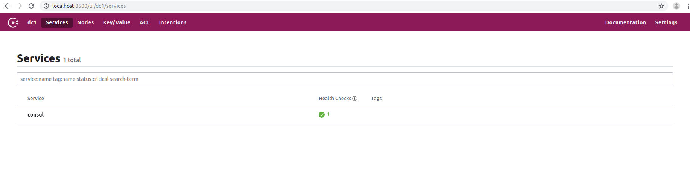

# Ubuntu安装Consul

Consul官网下载对应版本

https://www.consul.io/downloads.html

解压缩后进入目录

```bash
cd Downloads/consul_1.6.0_linux_amd64
```

启动Consul服务

```bash
./consul agent -dev
```

访问 http://localhost:8500


